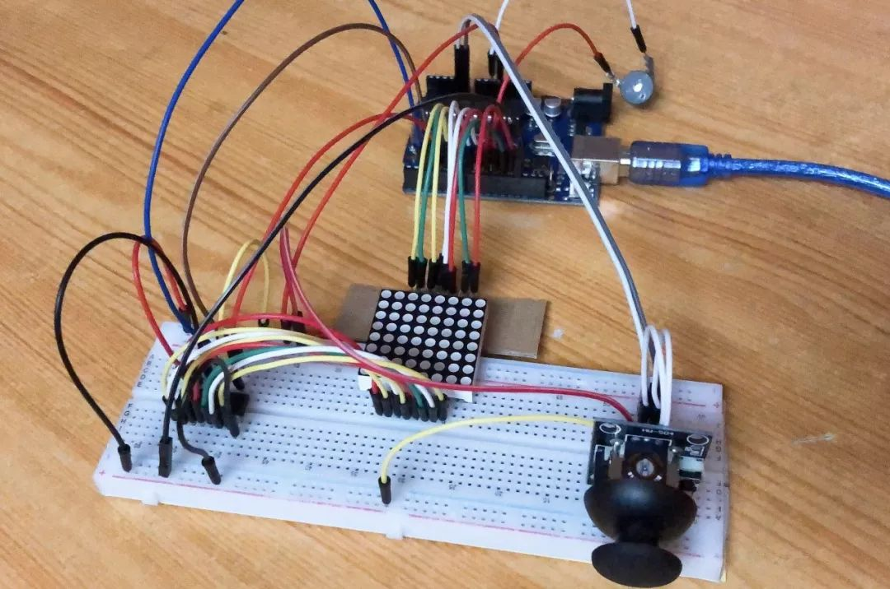
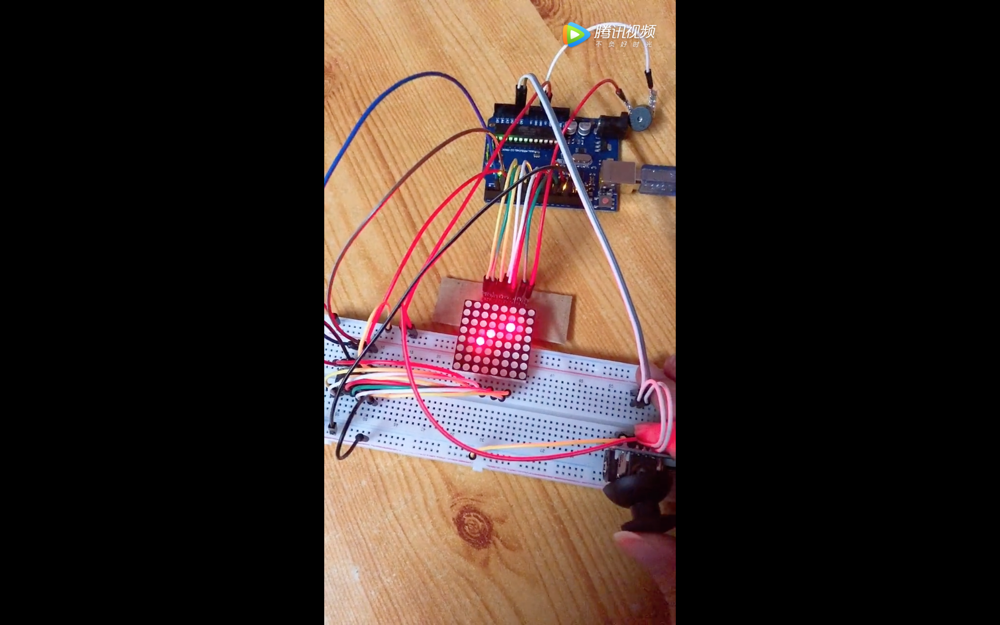

# 8x8 LED Matrix Game for Arduino

tiny Pac Man Game for Arduino using shift registers, joystick and RED 8x8 LED Matrix

## Breadboard Prototyping

Arduino powered Pac Man Game with one 74HC595 8 bit Shift Registers to control 1-8 pins of a single color 8x8 LED Matrix. A 5 pin 2 axis joystick is used to control the direction of the player on the display. Buzzer for the music.

## Parts Needed

- Arduino Uno
- RED 8x8 LED Matrix
- 74HC595
- Joystick
- Buzzer
- Breadboard
- Wires

## Fritzing Schematic

## See It in Action

